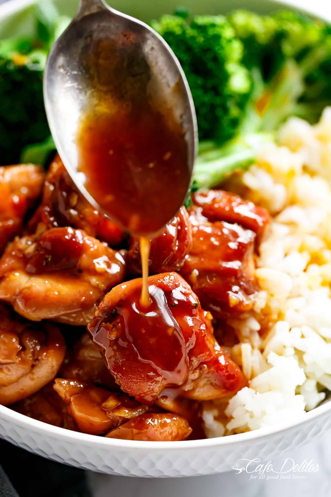

# markdown_sd1c

this is a test of markdown

## INGREDIENTS

1. 1.3 pounds (600 grams) skinless boneless chicken thighs, cut into 1 1/2-inch pieces
2. 1 tablespoon cooking oil
3. 1/4 cup low-sodium soy sauce
4. 3 tablespoons light brown sugar (or white granulated sugar)
5. 3 tablespoons cooking Sake ((rice wine vinegar or apple cider vinegar)
6. 2 tablespoons Mirin (optional -- white wine or dry sherry can be substituted)
7. 1 tablespoon sesame oil, optional (adds a wonderful flavour)
8. 2 teaspoons minced garlic (2 cloves garlic)*
9. 1 shallot/green onion stem, sliced to garnish
10. 4 cups broccoli florets, lightly steamed
11. 1 teaspoon cornstarch (or corn flour) mixed with 2 teaspoons water

